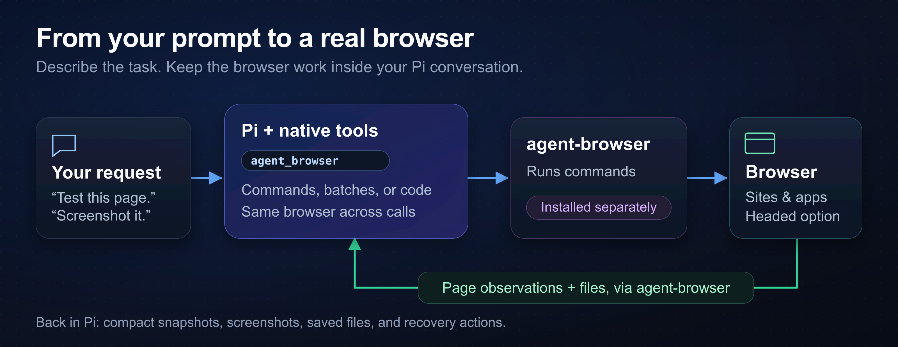

# pi-agent-browser-native

pi-agent-browser-native adds browser tools to [Pi](https://pi.dev). Use it to read pages, test web apps, and save screenshots through [agent-browser](https://agent-browser.dev/).



_Pi sends your task to the browser and returns page snapshots, screenshots, and saved files._

## Install and start

Use Node 24.21.0 or later and Pi 1.0.0 or later. This extension requires a separate agent-browser installation.

The recommended agent-browser version is 0.38.1. This extension accepts stable versions 0.35.0 or later.

```bash
npm install -g agent-browser@0.38.1
agent-browser install
pi install npm:pi-agent-browser-native
pi
```

`agent-browser install` downloads Chrome for Testing. On Linux, use `agent-browser install --with-deps` if browser libraries are missing. Android users need the [Termux setup](docs/REFERENCE.md#android--termux).

Ask Pi:

```text
Open https://example.com with agent_browser.
Take an interactive snapshot.
Save a screenshot to /tmp/example.png.
Close the browser when finished.
```

After a package update, quit Pi fully. Start Pi again to load the new tools. `/reload` can retain the previous compiled code.

Read the [command reference](docs/COMMAND_REFERENCE.md) for your next browser task.

## Browser tools

Describe the task in your conversation. Pi can click controls, fill forms, check text and URLs, and save files.

| Tool                       | Use                                                           |
| -------------------------- | ------------------------------------------------------------- |
| `agent_browser`            | Browser commands and fixed `batch --bail` sequences           |
| `agent_browser_code`       | JavaScript loops and branches in the same browser             |
| `agent_browser_tools`      | Enable action, QA, Electron, source, and network-source tools |
| `agent_browser_web_search` | Optional Exa or Brave search through provider APIs            |

For example, Pi opens and inspects a page with these calls:

```json
{ "args": ["open", "https://example.com"] }
{ "args": ["snapshot", "-i"] }
```

Snapshots give Pi current `@eN` references for controls. Refresh the snapshot after navigation or page changes. Check the resulting page after a click; command success alone does not prove the app changed.

For a trial without a saved package setting, run:

```bash
pi --no-extensions -e npm:pi-agent-browser-native
```

This command loads this extension explicitly and disables automatic extension loading. Other Pi settings and resource types still apply.

## Profiles and privacy

Ordinary calls use one named browser per root Pi session. A parent and its subagents share that browser. Separate roots get separate browser names.

Shared root browsers survive Pi exit. Ask Pi to close your group's browser when finished.

Profile access exposes private page content to the model. That content can persist in transcripts and saved files. Use temporary profiles for tests.

Credential-like values are redacted, but ordinary page text stays visible. Verify the signed-in page after you select a profile or restore browser state.

Ask for a headed browser if you need to watch a task or complete a login. Remote environments can keep the window off your desktop.

See [profiles and sessions](docs/REFERENCE.md#authenticatedprofile-workflows) for profile selection, restore limits, and cleanup.

## Optional search and settings

To enable web search, set `EXA_API_KEY` or `BRAVE_API_KEY` before you start Pi. Exa is the default when both keys work. Provider charges apply.

Set provider preferences and browser defaults in `~/.pi/config/pi-agent-browser-native/config.json`. Trusted projects can use `.pi/config/pi-agent-browser-native/config.json`. `PI_AGENT_BROWSER_CONFIG` selects an override file.

Read [configuration examples](docs/REFERENCE.md#optional-package-config-and-web-search) for secret references, provider selection, and profile defaults.

## Troubleshooting and limits

Run the read-only health check:

```bash
npm exec --package pi-agent-browser-native -- pi-agent-browser-doctor
```

It checks the browser CLI, supported versions, and duplicate Pi package sources. It does not change settings.

This is a pre-1.0 package. Windows qualification has a waiver. Android remains outside the release-blocking platform matrix. See the [support matrix](docs/SUPPORT_MATRIX.md) for details.

For recordings, install `ffmpeg` with the encoder for your WebM or MP4 output. Verify the completed file after you stop the recording.

For remote browsers, use a URL that the browser host can reach. `localhost` refers to the browser host.

For stale references or unexpected tabs, follow the returned recovery actions. Take a fresh snapshot before another interaction.

## More documentation

- [Detailed reference](docs/REFERENCE.md): platform setup, browser examples, compatibility notes, and development checks.
- [Tool contract](docs/TOOL_CONTRACT.md): exact inputs, results, code limits, and image geometry.
- [Electron guide](docs/ELECTRON.md): desktop discovery, isolated launch, and cleanup.
- [Session storage](docs/SESSION_STORAGE.md): replay, large histories, and session conversion.
- [Architecture](docs/ARCHITECTURE.md): extension design.
- [Code quality](docs/CODE_QUALITY.md) and [release process](docs/RELEASE.md): maintainer procedures.

## License

[MIT](LICENSE). Copyright Mitch Fultz.
